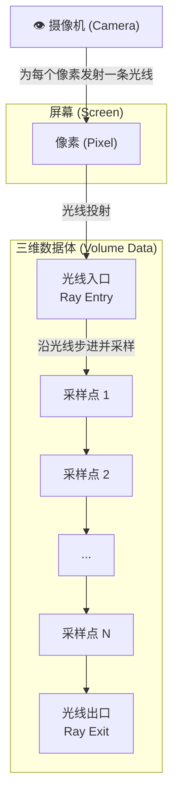
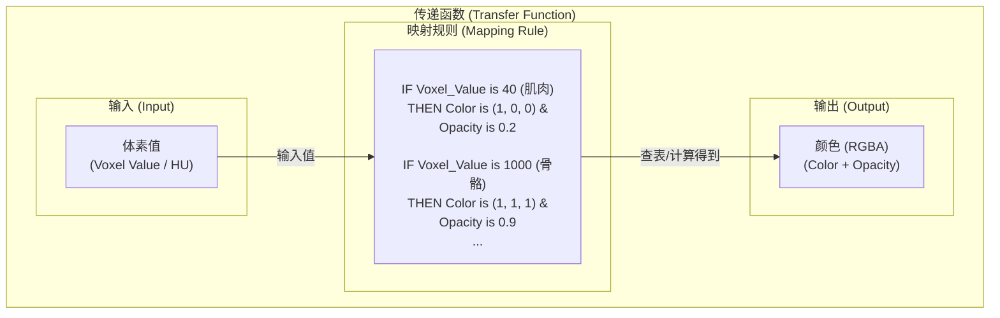

# 三维体渲染基础：光线投射与传递函数

本次学习我们开启了从二维切片浏览到真正三维体渲染的大门。核心是理解其背后的两大基石：**光线投射（Ray Casting）** 算法和**传递函数（Transfer Function）**。

## 1. 核心算法：光线投射 (Ray Casting)

### 1.1 是什么 (What is it?)

光线投射是一种模拟光线穿透半透明物体，从而渲染出物体内部结构的算法。它不再像过去一样只渲染一个平面，而是要渲染整个三维数据体（Volume）。

其基本流程是：

1.  **为每个像素发射光线**: 想象我们的屏幕是一块玻璃，摄像机（眼睛）从屏幕上的每一个像素点，向场景深处发射一条笔直的视线，即**光线（Ray）**。
2.  **光线步进 (Ray Marching)**: 当光线进入到我们的三维数据体（可以想象成一团半透明的彩色烟雾）后，它会沿着自身方向一步一步地前进。
3.  **采样与累积 (Sample & Accumulate)**: 在前进的每一步，光线都会"采样"当前位置的体素值（Voxel），并通过`传递函数`查询到该体素对应的颜色和不透明度。然后，根据一套合成公式（Over-Compositing），将当前采样点的颜色和不透明度与光线已经累积的颜色进行混合。
4.  **输出颜色**: 当光线穿出数据体，或者能量完全衰减（变为完全不透明）时，其最终累积的颜色就是这个屏幕像素应该显示的颜色。

下面是这个过程的示意图：



### 1.2 为什么能"穿透"物体？(The "Semi-Transparent" Analogy)

初学者最大的困惑是：为什么我们看到的不是物体表面？

关键在于，我们处理的CT数据体**不是一个不透明实体**，而应被理解为**一团浓淡不一的半透明烟雾**。我们的视线可以穿透稀薄的烟雾，看到其背后更浓的烟雾。光线投射累加的过程，正是模拟了视线穿过这团烟雾时，沿途颜色与透明度不断混合衰减的过程。

## 2. 控制核心：传递函数 (Transfer Function)

### 2.1 是什么 (What is it?)

传递函数是体渲染的"灵魂"，它定义了**如何将数据值（如CT的HU值）映射为视觉属性（颜色RGBA）**。它是一个"规则转换器"，告诉渲染器遇到特定数据值的体素时，该把它染成什么颜色、以及它的透明度是多少。



### 2.2 如何控制光线衰减？

传递函数直接回答了"光线强度和衰减程度是否可设置"的问题。**答案是肯定的**。

光线的"衰减"就是由传递函数映射出的**不透明度（Alpha）**来控制的。在光线步进的每一步，都会根据当前采样的不透明度来混合颜色。一个简化的混合公式如下：

`新总颜色 = (当前采样颜色 * 当前不透明度) + (旧总颜色 * (1 - 当前不透明度))`

通过精心设计传递函数，我们可以实现丰富的视觉效果：

- **组织凸显**: 只显示骨骼（将骨骼对应HU值的不透明度设为高，其余设为0）。
- **透视观察**: 将骨骼不透明度设为0.8，肌肉设为0.2，实现半透明的透视效果。

---

至此，我们已经建立了对三维体渲染基本原理的共识，为接下来的编码实现打下了坚实的理论基础。

### 状态管理架构

```javascript
const AppState = {
  series: {
    // DICOM数据
    slices: [],
    width,
    height,
    depth,
    isLoaded: false,
  },
  viewState: {
    // 渲染参数
    windowCenter,
    windowWidth,
    sliceIndex,
    alphaCorrection,
    steps,
    colorMode,
  },
  uiState: {
    // 交互状态
    tool: 'windowing',
    orbitControls: null,
  },
};
```

### 渲染器设计模式

采用策略模式实现多渲染器架构：

- **IRenderer**: 定义统一接口
- **Canvas2DRenderer**: 2D切片渲染实现
- **WebGLRenderer**: 3D体渲染实现

## 第三阶段：核心算法实现

### DICOM数据处理

```javascript
// 关键实现：序列加载与排序
async function loadDicomSeries() {
  // 1. 并行下载所有DICOM文件
  const arrayBuffers = await Promise.all(downloadPromises);

  // 2. 解析并提取位置信息
  const slices = arrayBuffers.map(buffer => {
    const dataSet = dicomParser.parseDicom(new Uint8Array(buffer));
    const imagePositionPatient = dataSet.string('x00200032').split('\\').map(parseFloat);
    return { dataSet, arrayBuffer: buffer, z: imagePositionPatient[2] };
  });

  // 3. 按Z轴位置排序
  slices.sort((a, b) => a.z - b.z);

  // 4. 构建3D纹理
  const texture = new THREE.Data3DTexture(volumeData, width, height, depth);
}
```

### 体渲染着色器实现

```glsl
// 核心片元着色器
void main() {
    vec3 rayDir = normalize(vWorldPosition - cameraPosition);
    vec3 currentPos = vWorldPosition;
    vec3 step = -rayDir * (1.0 / uSteps);

    vec4 accumulatedColor = vec4(0.0);

    for (float i = 0.0; i < uSteps; i += 1.0) {
        vec3 uvw = currentPos + 0.5;

        // 边界检查
        if (any(lessThan(uvw, vec3(0.01))) || any(greaterThan(uvw, vec3(0.99)))) {
            currentPos += step;
            continue;
        }

        float rawValue = texture(uVolume, uvw).r;

        // 传递函数映射
        vec4 sampleColor = uColorMode ?
            getColorFromDensity(rawValue) :
            getGrayscaleFromDensity(rawValue);

        sampleColor.a *= uAlphaCorrection;

        // Over-compositing
        accumulatedColor.rgb += (1.0 - accumulatedColor.a) * sampleColor.rgb * sampleColor.a;
        accumulatedColor.a += (1.0 - accumulatedColor.a) * sampleColor.a;

        if (accumulatedColor.a >= 0.95) break;
        currentPos += step;
    }

    out_FragColor = accumulatedColor;
}
```

## 第四阶段：问题解决与优化

### 关键技术挑战

#### 1. 初始化错误系列

**问题**：`renderer.getCamera is not a function`、`setRenderMode is not a function`
**原因**：接口不匹配、this指向丢失
**解决方案**：

```javascript
// 使用箭头函数确保this上下文
class WebGLRenderer {
  getCamera = () => {
    return this.camera;
  };

  resize = () => {
    this.onWindowResize();
  };
}
```

#### 2. 着色器编译错误

**问题**：`gl_FragColor undeclared identifier`、`cameraPosition redefinition`
**原因**：GLSL版本兼容性问题、Three.js内置uniform冲突
**解决方案**：

```glsl
// 使用GLSL 3.00规范
#version 300 es
out vec4 out_FragColor;  // 替代gl_FragColor
// 移除重复的uniform声明
```

#### 3. 数据类型不匹配

**问题**：`type FLOAT but ArrayBufferView not Float32Array`
**原因**：整数数据与浮点纹理类型不匹配
**解决方案**：

```javascript
// 数据类型转换
const integerVolumeData = new Int16Array(rawData);
const floatVolumeData = new Float32Array(integerVolumeData);

const texture = new THREE.Data3DTexture(floatVolumeData, w, h, d);
texture.type = THREE.FloatType;
texture.format = THREE.RedFormat;
```

#### 4. 渲染质量问题

**问题**：小黑点伪影、透视变形、旋转限制
**解决方案**：

- **伪影消除**：边界保护 + 数值稳定性检查
- **透视修正**：正交相机替代透视相机
- **旋转自由**：解除OrbitControls角度限制

```javascript
// 边界保护
vec3 margin = vec3(0.01);
if (any(lessThan(uvw, margin)) || any(greaterThan(uvw, 1.0 - margin))) {
    continue;
}

// 数值稳定性
if (isnan(rawValue) || isinf(rawValue)) {
    continue;
}

// 正交相机配置
this.camera = new THREE.OrthographicCamera(-size * aspect, size * aspect, size, -size, 0.1, 100);

// 旋转限制解除
controls.minPolarAngle = 0;
controls.maxPolarAngle = Math.PI;
controls.minAzimuthAngle = -Infinity;
controls.maxAzimuthAngle = Infinity;
```

## 第五阶段：高级功能实现

### 彩色解剖学渲染

基于医学知识的组织颜色映射：

```glsl
vec4 getColorFromDensity(float density) {
    if (density < -900.0) {
        // 空气：透明
        return vec4(0.0, 0.0, 0.0, 0.0);
    } else if (density < -400.0) {
        // 肺组织：粉红色
        float t = (density + 900.0) / 500.0;
        return vec4(1.0, 0.4 + t * 0.3, 0.4 + t * 0.3, t * 0.1);
    } else if (density < -50.0) {
        // 脂肪：黄色
        float t = (density + 400.0) / 350.0;
        return vec4(1.0, 0.8, 0.2, t * 0.3);
    } else if (density < 100.0) {
        // 软组织：红褐色
        float t = (density + 50.0) / 150.0;
        return vec4(0.8, 0.3, 0.2, t * 0.5);
    } else if (density < 400.0) {
        // 血液/器官：深红色
        float t = (density - 100.0) / 300.0;
        return vec4(0.6, 0.1, 0.1, t * 0.7);
    } else {
        // 骨骼：白色/米色
        float t = min((density - 400.0) / 600.0, 1.0);
        return vec4(0.9 + t * 0.1, 0.85 + t * 0.15, 0.7 + t * 0.3, t * 0.9);
    }
}
```

### 专业UI控制面板

- **预设窗口**：骨窗(500,1000)、软组织(40,400)、肺窗(-600,1500)、脑窗(40,80)
- **实时滑动条**：窗宽窗位、透明度、采样质量
- **模式切换**：彩色/灰度渲染模式
- **元数据显示**：图像信息、渲染参数

## 技术栈总结

### 核心技术组件

- **前端框架**：原生JavaScript + HTML5
- **3D渲染**：Three.js + WebGL + GLSL 3.00
- **医学影像**：DICOM解析（dicom-parser）
- **交互控制**：OrbitControls + 自定义事件

### 性能优化策略

1. **GPU加速**：着色器实现核心算法
2. **内存优化**：Float32Array数据转换
3. **渲染优化**：早期退出、边界裁剪
4. **交互优化**：按需渲染、阻尼控制

## 学习方法论

### 四步工作流

1. **理论学习**：理解"是什么"和"为什么"
2. **设计探讨**：确定"怎么做"的技术方案
3. **编码实现**：完成具体的代码实现
4. **知识沉淀**：文档化和经验总结

### 问题解决方法

- **系统性调试**：从简单到复杂，逐步定位
- **技术文档查阅**：Three.js官方文档、WebGL规范
- **实验验证**：小范围测试验证假设
- **经验积累**：记录问题和解决方案

## 应用价值

### 医学应用场景

- **诊断影像**：三维病灶定位和测量
- **手术规划**：术前三维解剖结构分析
- **教学培训**：医学院校解剖学教学
- **科研分析**：医学影像算法研究

### 技术拓展方向

- **多平面重建**：MPR、CPR显示
- **高级传递函数**：梯度增强、多维映射
- **体积光照**：阴影和环境光模拟
- **交互式分割**：实时组织分离
- **VR/AR集成**：沉浸式医学可视化

## 项目总结

本项目成功实现了从零到一的医学影像三维体渲染系统，具备工业级应用水准。通过系统的理论学习、严谨的工程实践和持续的问题解决，不仅掌握了体渲染的核心技术，更建立了完整的图形学开发能力体系。

这次学习历程充分验证了"理论指导实践，实践检验理论"的学习方法有效性，为未来的图形学项目开发奠定了坚实基础。

---

**文档版本**：v1.0  
**创建时间**：2024年  
**覆盖内容**：理论基础、技术实现、问题解决、优化实践  
**适用人群**：前端开发者、医学影像工程师、图形学学习者
